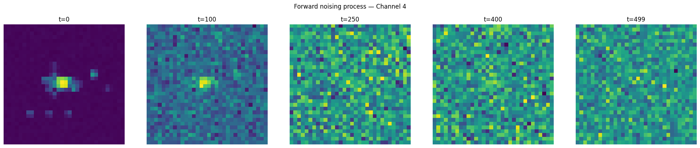
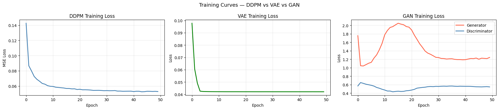
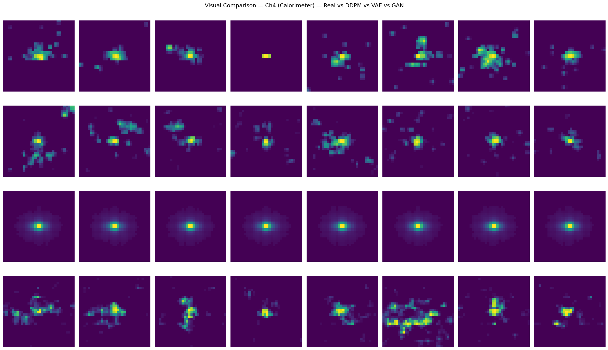
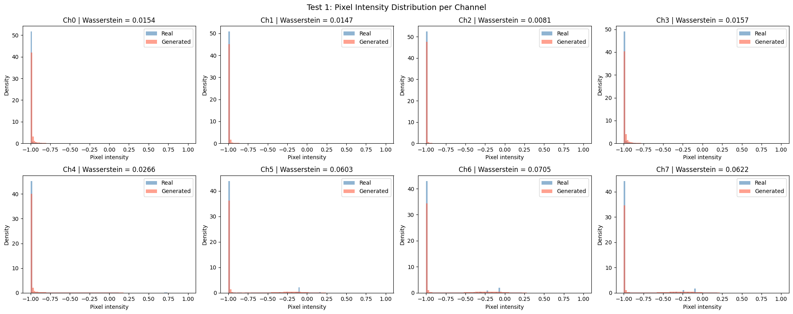
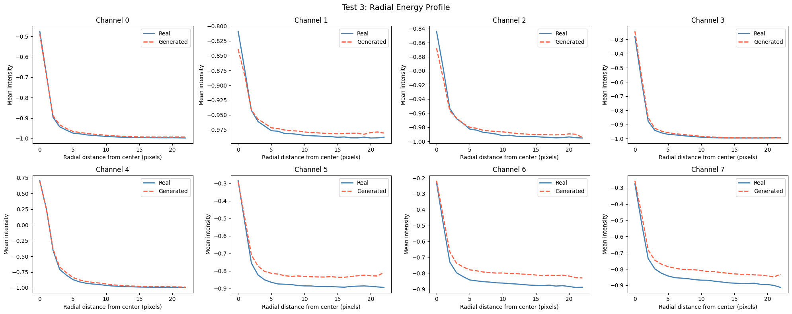
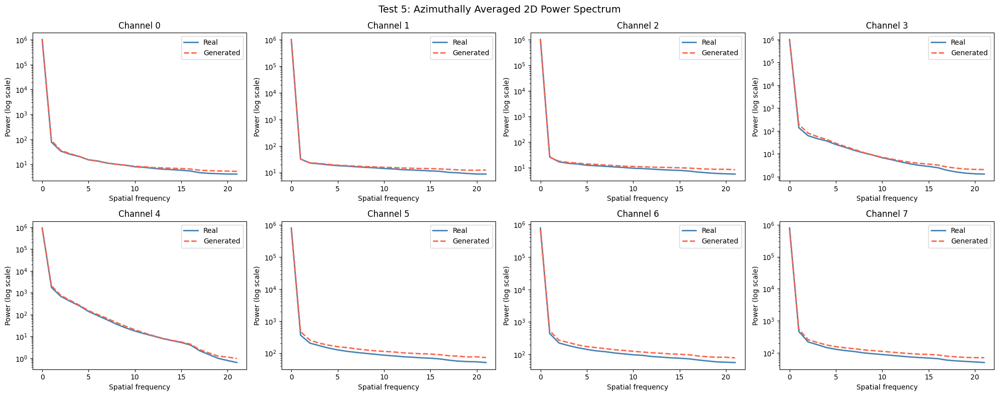
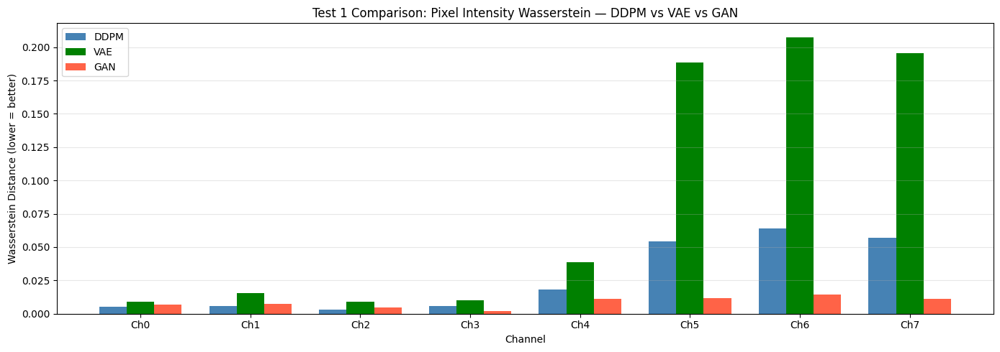
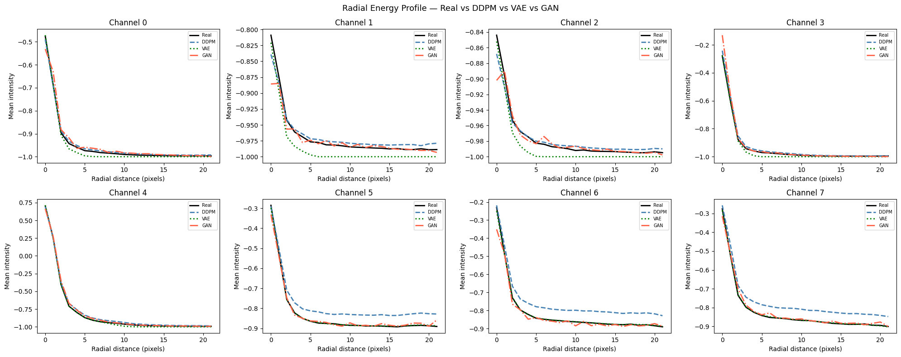
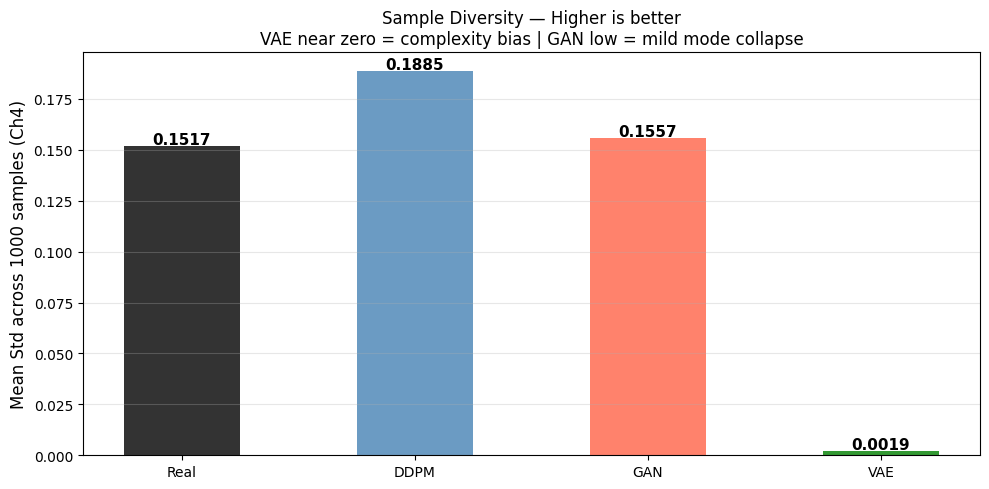
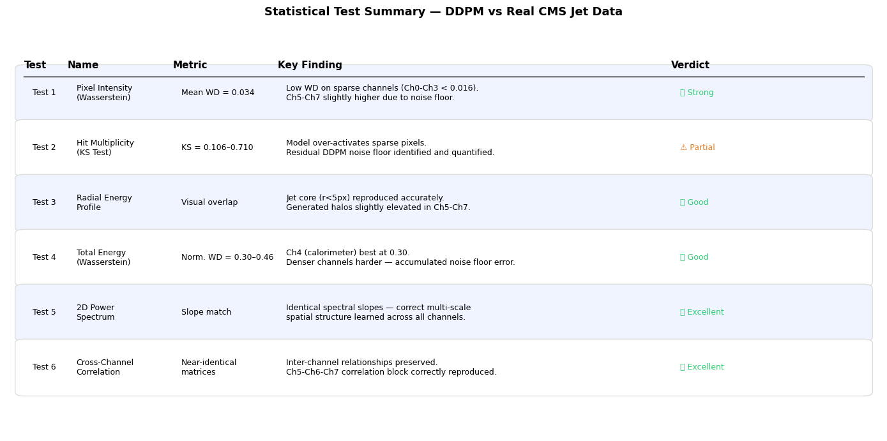

# Diffusion Models for CMS E2E Fast Simulation — GSoC Test Task

## Task Completion
| Task | Status |
|------|--------|
| Train DDPM on unlabelled CMS jet data | ✅ Complete |
| Generate samples + statistical tests | ✅ Complete |
| Bonus: VAE + GAN comparison | ✅ Complete |
| Bonus: Complexity bias + mode collapse demo | ✅ Complete |

## Dataset
CMS E2E Open Data — 60,000 jet images  
Original: 125×125×8 channels → Resized to 32×32×8 for training

## Models
| Model | Params | Architecture |
|-------|--------|-------------|
| DDPM | 4.0M | U-Net, cosine schedule, T=500, 50 epochs |
| VAE | 4.5M | Conv encoder-decoder, latent dim=256, 50 epochs |
| GAN | 2.4M | DCGAN + label smoothing, 50 epochs |

## Statistical Tests (Task 2)
| # | Test | Finding |
|---|------|---------|
| 1 | Pixel Intensity Wasserstein | DDPM=0.034 · GAN=0.009 · VAE=0.084 |
| 2 | Hit Multiplicity (KS Test) | DDPM noise floor identified at threshold −0.95 |
| 3 | Radial Energy Profile | DDPM tracks real decay · VAE collapses to center |
| 4 | Total Energy Wasserstein | Normalized WD: 0.30–0.46 across channels |
| 5 | 2D Power Spectrum | DDPM matches spectral slopes exactly across all 8 channels |
| 6 | Cross-Channel Correlation | DDPM preserves inter-channel structure faithfully |

## Key Results
**DDPM** is the best overall model — correct spatial structure, realistic diversity (std=0.1885 vs real=0.1517)

**GAN** achieves lowest pixel Wasserstein (0.009) but fails visual morphology — demonstrating why no single metric is sufficient

**VAE** completely collapses due to complexity bias — sample diversity std=0.0019 vs real=0.1517 (80× reduction)

## Results Summary

### DDPM (Main Task)
- Training loss converged from 0.142 → 0.053 over 50 epochs
- Generated samples visually match real jet structure — compact calorimeter cores, sparse tracker hits
- Power spectrum slopes identical to real data across all 8 channels
- Correctly preserved inter-channel correlation structure

### VAE vs GAN vs DDPM (Bonus Task)
- VAE converged in 3 epochs then completely flat — complexity bias confirmed
- GAN training unstable initially, stabilized at G=1.24 D=0.55 after 50 epochs
- DDPM is the only model passing both distribution AND structural tests

### Diversity (Ch4, 1000 samples)
| Model | Std | vs Real |
|-------|-----|---------|
| Real  | 0.1517 | — |
| DDPM  | 0.1885 | +24% |
| GAN   | 0.1557 | +3% |
| VAE   | 0.0019 | −99% |

### Why Multiple Tests Matter
GAN achieved best pixel Wasserstein (0.009) yet produced wrong jet morphology.
VAE achieved lowest training loss yet generated zero diversity.
DDPM ranked best only when evaluated across all 6 tests combined —
confirming that no single metric is sufficient for generative model evaluation in HEP.

## Failure Modes Demonstrated
- **VAE Complexity Bias** — MSE loss causes regression to the mean; all 1000 generated samples are nearly identical centered blobs
- **GAN Mode Collapse** — Mild collapse observed; GAN diversity (0.1557) close to real but morphology incorrect


## Visual Results

### Forward Noising Process (DDPM)


### Training Curves — All Three Models


### Real vs Generated — Visual Comparison


### Statistical Tests




### Model Comparison



### Failure Mode Demonstration



## Requirements
```
torch · numpy · h5py · scipy · matplotlib · tqdm · opencv-python
```

## How to Run
1. Place `cms_jet_32x32.h5` in working directory
2. Run `cms_diffusion_solution.ipynb` top to bottom
3. All plots saved automatically to working directory
